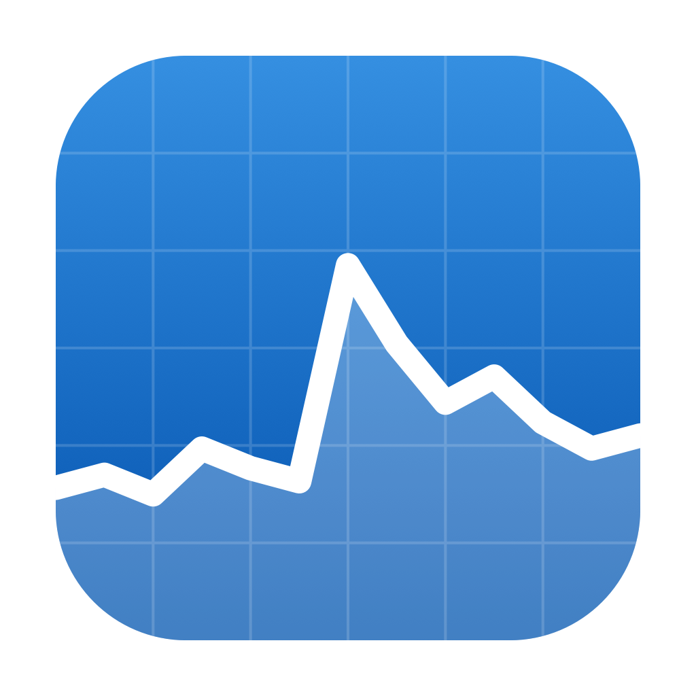
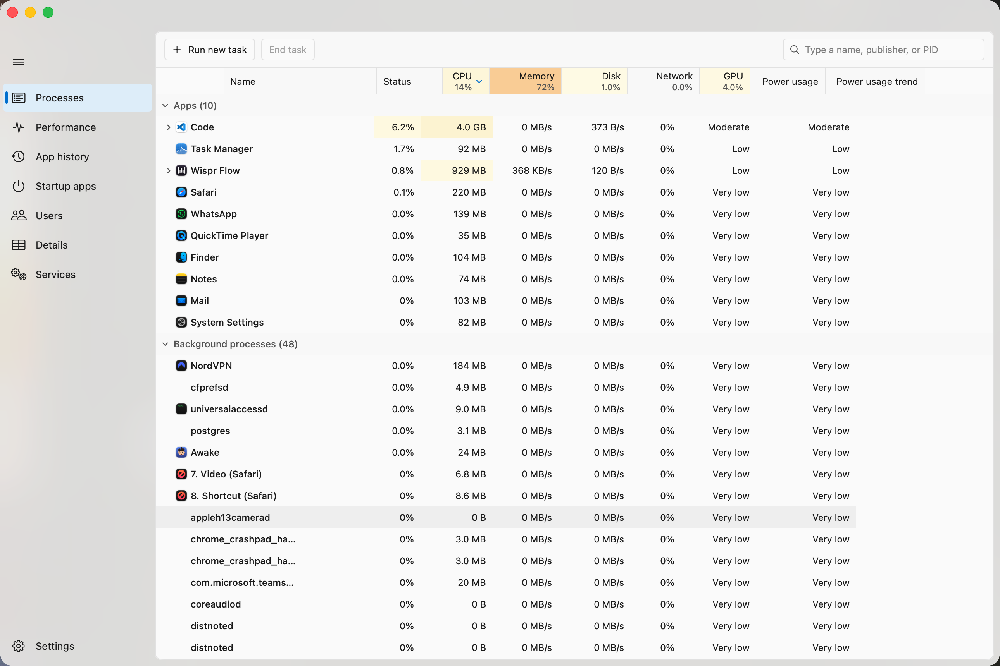

<div align="center">



# Task Manager for Mac

### The Windows 11 Task Manager, on your Mac.

[**⬇ Download for macOS**](https://github.com/yatindma/task-manager-for-mac/releases/latest/download/TaskManager.dmg)

<sub>macOS 14+ · Apple Silicon & Intel · Free & open source · No dependencies</sub>

</div>



<br>

You press <kbd>Ctrl</kbd>+<kbd>Shift</kbd>+<kbd>Esc</kbd> a hundred times a week on Windows. Then you sit at a Mac, and it's Activity Monitor — different layout, different words, no heatmap, no muscle memory.

This is the actual Task Manager. Same seven tabs. Same colours. Same graphs. On your Mac.

<br>

## Get it

1. [**Download the DMG**](https://github.com/yatindma/task-manager-for-mac/releases/latest/download/TaskManager.dmg)
2. Open it, drag **Task Manager** into **Applications**
3. **Right-click the app → Open** (just the first time)

> **Why right-click the first time?** macOS blocks apps that haven't paid Apple's $99/year
> signing fee, and shows a scary "could not verify" box. Right-click → Open tells macOS you
> trust it. You only do this once. Every line of code is in this repo if you'd rather check.

<br>

## What's inside

| Tab | What it shows |
|:--|:--|
| **Processes** | Every app and process, with the heatmap that turns yellow → red as things get busy |
| **Performance** | Live CPU, memory, disk, network and GPU graphs |
| **App history** | How much CPU and network each app has used over time |
| **Startup apps** | What launches when you log in — turn things off |
| **Users** | Who's signed in and what they're running |
| **Details** | The dense list: PID, threads, priority |
| **Services** | Background system services |

Right-click anything to **End task**, **End process tree**, **Suspend** or **Resume** — exactly like Windows.

<br>

## Three things it can't do

macOS won't let *any* app read these, so instead of showing you a made-up number, it shows nothing:

- **GPU % per process** — the overall GPU graph works, the per-app column doesn't
- **Startup impact** — macOS never measures it
- **Set affinity** — no such control on macOS

There's also a **one-time password prompt** if you want to see system processes like `WindowServer`. You can say no and everything else still works.

[Read the full honest list →](docs/limitations.md)

<br>

## Build it yourself

```bash
git clone https://github.com/yatindma/task-manager-for-mac.git
cd task-manager-for-mac
./build.sh
open "Task Manager.app"
```

You'll need Xcode installed. That's it — no packages to install, nothing to configure.

<br>

## Under the hood

Swift 6 + SwiftUI, built with SwiftPM, **zero third-party dependencies**, about 5 MB.

Some of it was more interesting than it should have been — [the notes are here](docs/limitations.md#things-that-bit-us), including the one where every process reported 41× too little CPU because Apple's docs say "nanoseconds" and mean something else.

<br>

## License

MIT — do what you like. See [LICENSE](LICENSE).

## Contributing

Issues and PRs welcome — and if this saved you some muscle memory, a ⭐ helps other people find it.

Reporting a wrong number? Tell us your Mac's chip and what Activity Monitor says — that comparison has already caught real bugs.
